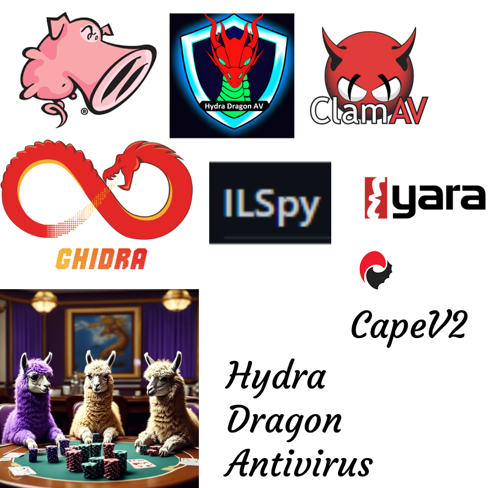

# HydraDragonAV
 Hydra Dragon Antivirus For Linux

**Hydra Dragon Antivirus** is an endpoint antivirus solution that utilizes multiple malware detection engines to analyse and detect threats.

##  Documentation && Installation && FAQ

Read [docs](docs/html/index.html) here.

## Discord Community Server

- Here is the server link: https://discord.gg/jNtANEXJ

## Download Machine Learning Malware And Benign Database
- **Malware Database:** [Download Link](https://drive.google.com/file/d/1QwdxdwX_nH-oF-5hVTkbTuFkrwUfR0-h)
- **Benign Database:** [Download Link](https://drive.google.com/file/d/1ynUPnLLm3O6QrlCpDz7A0h1QqjIK3Icc)
- **Note:** Only contains PE files.
- **Password:** infected

## Short information about the project

- Although there have been supporters of this project in the past, it's still a one man project. 
- I searched the whole internet for signatures, heuristics etc.
- It took me 1.5 years to get to this stage.
- Feel free to open issues, pull requests etc.